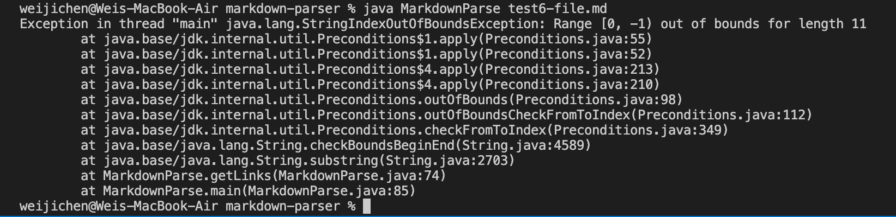
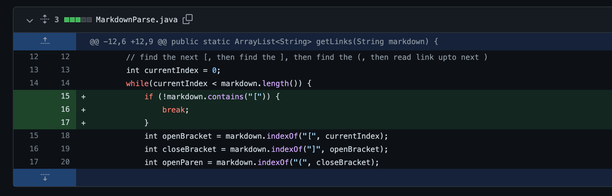
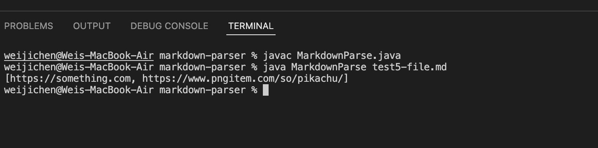
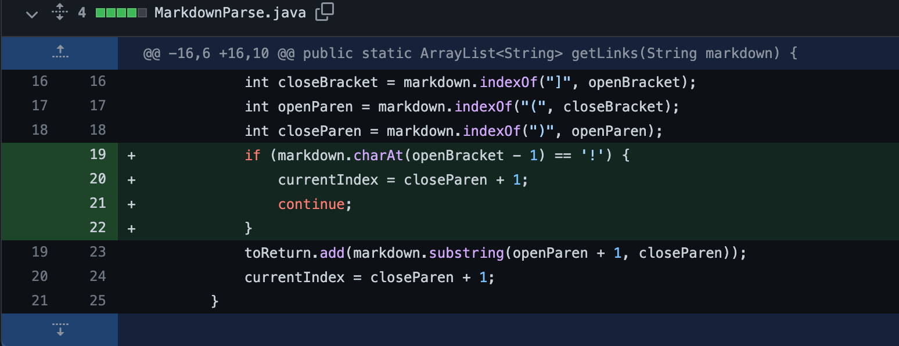
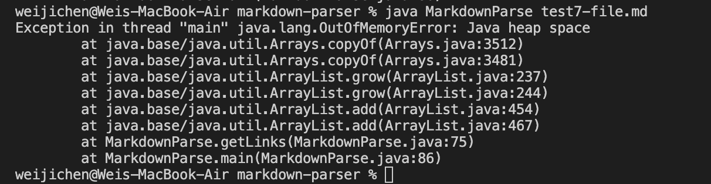
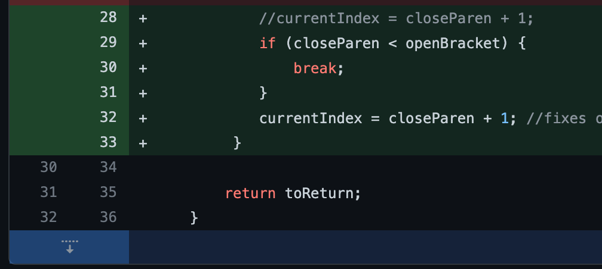

## **Lab Report 2** 

--- 

In this lab report, I will introduce the code changes made to the MarkdownParse file in order for three test files that did not originally pass the code in MarkdownParse to pass. We will be analyzing the three failure inducing input (FII) and the  subsequent changes made to the MarkdownParse code in order to have the test files pass successfully. 

--------

### First FII  ###
---
The first FII leads to the error of StringIndexOutofBoundsException, which occurs when a file is empty, as in it doesn't contain any links. Thus, the failure inducing input is a file without any link or links. 

_Test File of the FII_

Test file of the FII: [Link](https://github.com/Wei-Ji-Chen/markdown-parser/blob/main/test6-file.md)

_Symptom of FII_

This FII led to the following output:

_Solution to FII_

The changes in the code made to fix the bug causing the FII to not run successfully is highlighted in green in the image below.

The failure inducing input of this case is a file without any link or links. In the original MarkdownParse, the code would run and try to find the index of '[', however, in a file where there is no link, the bracket doesn't exist. This is thus, the bug. This would then lead to the symptom, which is the StringIndexOutofBoundsException, indicating an out of bounds. In order to fix this, an if statement is written that under the condition markdown does not contain the bracket, indicating there is no link, the code would break. This ensures it does not try to find a link or links when none exist. 

------

### Second FII ### 
---

The second FII concerns the code looking and returning the name of an image, even though the code was designed to only identify links. 

_Test File of the FII_

Test file of the FII: [Link](https://github.com/Wei-Ji-Chen/markdown-parser/blob/main/test5-file.md)

_Symptom of FII_

This FII led to the following output: 

_Solution to FII_

The changes in the code made to fix the bug causing the FII to not run successfully is highlighted in green in the image below. 

The failure inducing input in this case is an image, specifically concerning the coding syntax of inserting an image. The link to the test file contains the code that inserts an image in the file. The original MarkdownParse file doesn't check for the exclamation mark "!", which indicates the code for inserting an image. This is the bug. Thus, it returns the output "[https://something.com, https://www.pngitem.com/so/pikachu/]", the symptom, because the MarkdownParse code is reading that as if it's a link. Therefore, this shows the code is unable to differentiate between code written for links and code written for an image. Thus, in order to fix this, an if statement is written to check for the exclamation mark before the "[" printing to ensure that the link is not for an image. This way, if it detects the "!", the loop breaks, otherwise, it continues. 

--------

### Third FII ### 

--------

The third failure inducing input is when there is a missing paranthesis after a bracket. If the file doesn't contain a close paranthesis after the bracket, this causes an infinite loop error as the output. 

_Test File of the FII_

This is the test file of the FII: 
[Link](https://github.com/Wei-Ji-Chen/markdown-parser/blob/main/test7-file.md)

_Symptom of FII_
This FII led to the following output:

_Solution to FII_

The solution to the FII is highlighted in green in the image below.

A test file was written in which there was no paranthesis after the bracket. This led to an infinite loop with the OutofMemoryError, which is the symptom of the FII. Thus, the failure inducing input is when there is no paranthesis after a bracket. The bug in this case is that because of the FII, the missing close paranthesis after the bracket, the currentIndex is updated to a smaller number, which is -1, and enter an infinite loop, which is the symptom. 

In order to fix this problem, an if statement is written that in the case closeParen is less than openBracket, the code will break.

