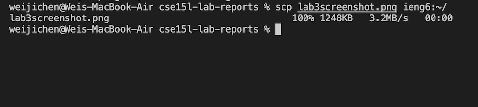
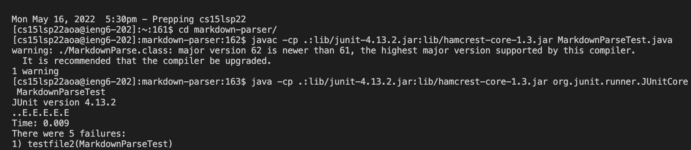

## **Remote Operations** 

In this lab report, we will be focusing on ieng6 remote operations. The main three sections of this will be streamlining ssh configuration, setting up Github Access from ieng6, and copying directories with scp-r. 

-----
### **Streamline SSH Configuration** 
-----
First, streamlining the SSH configuration will make logging into the ieng6 account be a much more efficient process. Normally, logging into ieng6 involves typing out `ssh cs15lsp22zzz@ieng6.ucsd.edu`
which can be tedious when this command needs to be repeatedly used. To make this more efficient, a configuration file can be created. By putting an entry in `~/.ssh/config`, you can specify to SSH the username to use when logging into servers.

My .ssh/config file image is shown below. This was edited on VSCode as seen in the image. 

The configuration file, if setup correctly, will then allow the input of `ssh ieng6` in terminal to log into the ieng6 account. 

The image below shows the results of using the ssh command to log into the ieng6 account using the alias ieng6. The alias doesn't have to be ieng6, it can be anything. It's simply a name ssh is interpreting.

Furthermore, we can use an scp command to copy a file into the account using the alias ieng6. In my case, the file was lab3screenshot.png. The image below shows the result. 

-----
### **Setup Github Access from ieng6** 
-----

In order to commit and push from the command line, first, a token-based login mechanism like SSH keys must be used. In order to do this, first check for existing SSH keys, generate a new SSH key, before adding a new SSH key to the Github account. This link will have more information [Link](https://docs.github.com/en/authentication/connecting-to-github-with-ssh/adding-a-new-ssh-key-to-your-github-account). 
The goal of this is to ensure a public key is added as part of the remote access lab to Github. If this works, the git commands `git add .`, `git commmit -m`, and `git push` should be fully functioal in the terminal. `git push origin main` should also be functional in the command line after committing to push the changes to Github.

First, there's the public key and the private key. Both are shown below in the images.

The image below shows where the public key I made is stored in Github and my user account. 

The image below shows where the private key I made is stored in my user account. 

#

Now, since the keys have been established, git commands for commit and push can be ran in the terminal. In my case, I made a change to the SkillDemo file by adding a second test file, called test2. 

The images below shows the git commands to commit and push a change to Github while logged into the ieng6 account. First, `git add .`, then `git commit -m"adding another test file`, before `git push` to upload the change (the additional test file) to the Github repository.

A link to the resulting commit is included below. 

[Link](https://github.com/Wei-Ji-Chen/SkillDemo/commit/a86ed220191fb9f21a112e9cffb1bd6d9db9bb67)

-----
### **Copy Whole Directories with scp-r** 
-----
Oftentimes, it's necessary to copy entire directories. To copy single files line by line using scp will be an extremenly tedious and inefficient task. In order to handle entire directories, the `scp -r` command can be used. `scp -r . cs15lsp22@ieng6.ucsd.edu:~/markdown-parse` will copy the markdown-parse directory. The r means the scp will copy recursively, the . is the source and current directory and markdown-parse is specifying the name of the directory scp is creating on the remote server (in the case it doesn't exist) and copy the contents of this directory there. 

The image below shows copying the markdown-parser directory into the ieng6 account. 

Afterwards, you can log into the ieng6 account and compile and run the tests. To log into the ieng6 account, just do `ssh ieng6` and then the following commands to compile and run the tests: 

`javac -cp .:lib/junit-4.13.2.jar:lib/hamcrest-core-1.3.jar MarkdownParseTest.java`

`java -cp .:lib/junit-4.13.2.jar:lib/hamcrest-core-1.3.jar org.junit.runner.JUnitCore MarkdownParseTest`

The results are shown in the image.

Lastly, it's possible to combine scp and ssh to copy the whole directory and run the tests in one line.

`scp -r *.java *.md lib/ ieng6:markdown-parser; ssh ieng6 "cd markdown-parser/; /software/CSE/oracle-java-17/jdk-17.0.1/bin/javac -cp .:lib/junit-4.13.2.jar:lib/hamcrest-core-1.3.jar MarkdownParseTest.java; /software/CSE/oracle-java-17/jdk-17.0.1/bin/java -cp .:lib/junit-4.13.2.jar:lib/hamcrest-core-1.3.jar org.junit.runner.JUnitCore MarkdownParseTest"`

The results are shown in the image.

