## **MarkDownParse Snippets** 
----------------

In this report, three MarkdownPrase snippets of code will be run with a test of each snippet. The tests will be run against my implementation of markdown-parse and the reviewed implementation of another markdown-parse. In total, there will be six tests total, three tests for my implementation of markdown-parse and another three tests for the reviewed implementation of markdown-parse. 

For each snippet of code, there will be five sections, 1) Expected Output, 2) Test in MarkdownParse, 3) Output of Test in my implementation, 4) Output of Test in the reviewed implementation, and 5) Code Changes to make it work. 

------

A link to my markdown-parse repository:
[Link](https://github.com/Wei-Ji-Chen/markdown-parser)

A link to the reviewed markdown-parse repository: 
[Link](https://github.com/aejiang/markdown-parser)

--------------
## Snippet 1 ## 
---------------

`[a link`](url.com)

[another link](`google.com)`

[`cod[e`](google.com)

[`code]`](ucsd.edu)

-------------
**Expected Output**

The expected output of Snippet 1 is three links: 
` 'google.com, google.com, ucsd.edu`

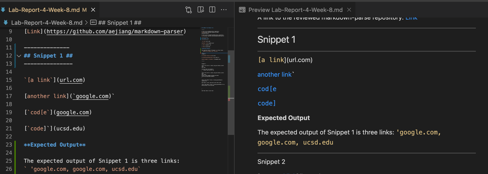

-----
**Test in MarkdownParseTest.java** 

The image below shows the code for how it was turned into a test in MarkdownParseTest.java

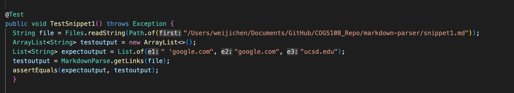

----------
**Output of Test in my implementation** 

The image below shows the result of running the test 

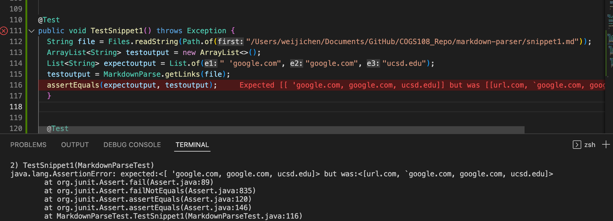

The image shows that the test does not run in my implementation 

---------------
**Output of Test in the reviewed implementation** 

The image below shows the result of running the test 

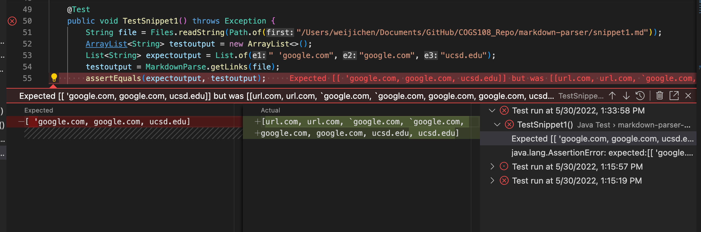

The image shows that the test does not run for the reviewed implementation 

-------------
**Code Change to Fix Program**

To make the program work, the code contained within the backticks need to be checked. It need to check if the code within the backticks changes the markdown link. A link will need to have [] and () and if the backticks changes either the bracket or paranthesis, the markdownlink doesn't work. 

To be more specific, the problem that's causing the program to not produce the expected output is that the backticks could cause the contents inside the brackets and paranthesis to not generate a link. If the backticks change the bracket or paranthesis so that they are no longer in the link, the markdown link wouldn't work. Therefore, the code change of checking if the backticks change the markdown link is necessary to make the program run

-------------------
## Snippet 2 ##

-------------

[a [nested link](a.com)](b.com)

[a nested parenthesized url](a.com(()))

[some escaped \[ brackets \]](example.com)

-------------
**Expected Output**

The expected output of Snippet 2 is three links: 
`a.com, a.com(()), example.com`

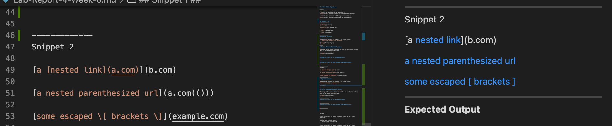

---------------
**Test in MarkdownParseTest.java** 

The image below shows the code for how it was turned into a test in MarkdownParseTest.java

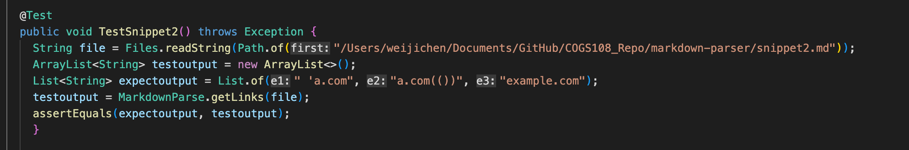

---------------
**Output of Test in my implementation** 

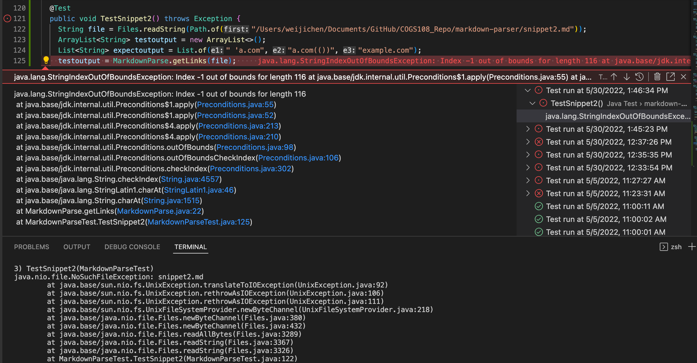

As evident, the test does not work in my implementation.

---------------
**Output of Test in the reviewed implementation** 

As the image shows, the test does not work in the reviewed implementation

-------------
**Code Change to Fix Program**

The code changes needed to fix this is to check if brackets or paranthesis or escaped brackets are a closing pair. This means that the contents contained inside of brackets, paranthesis, or escaped brackets are closed. Without the brackets, paranthesis, or escaped brackets closing the contents inside, it will affect the markdownlinks. 

--------------

## Snippet 3 ##
--------------

[this title text is really long and takes up more than 
one line

and has some line breaks](
    https://www.twitter.com
)

[this title text is really long and takes up more than 
one line](
https://sites.google.com/eng.ucsd.edu/cse-15l-spring-2022/schedule
)

[this link doesn't have a closing parenthesis](github.com

And there's still some more text after that.

[this link doesn't have a closing parenthesis for a while](https://cse.ucsd.edu/

)

And then there's more text

----------------
**Expected Output**

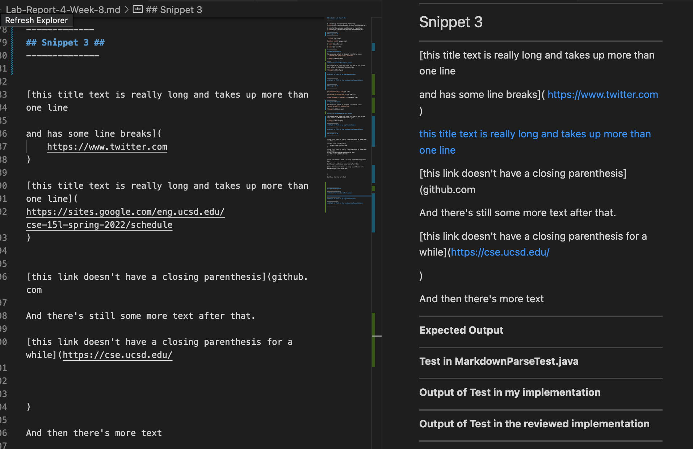

-------------------
**Test in MarkdownParseTest.java** 

The image below shows the code for how it was turned into a test in MarkdownParseTest.java

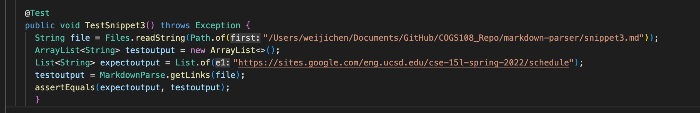

------------------
**Output of Test in my implementation** 

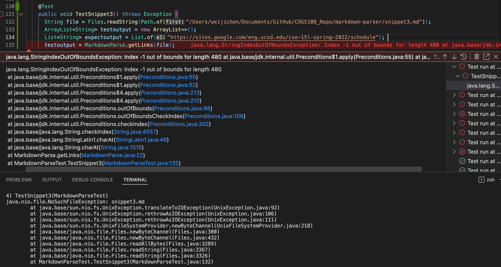

The image shows that the test does not work in my implementation

---------------
**Output of Test in the reviewed implementation** 

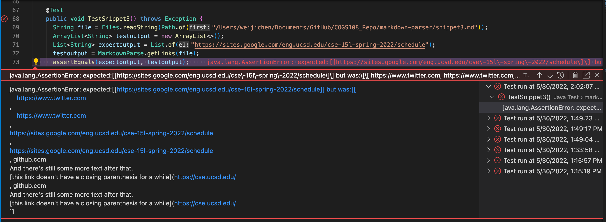

The image shows that the test does not work for the reviewed implementation

-------------
**Code Change to Fix Program**

An if statement can be written to check if there are newlines within the brackets [] or paranthesis (). If there is, skip the line, else, the contents within () are printed out. The problem is that with newlines, it separates various parts of the code, such as paranthesis and brackets. Thus, the code change necessary is to check for newlines in the paranthesis and brackets. 

------------

