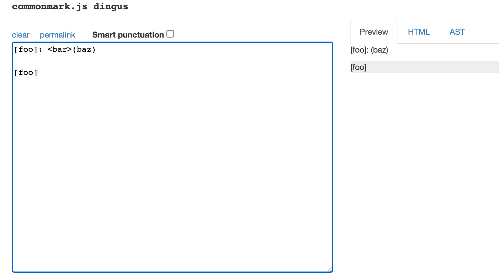
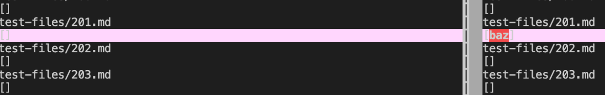
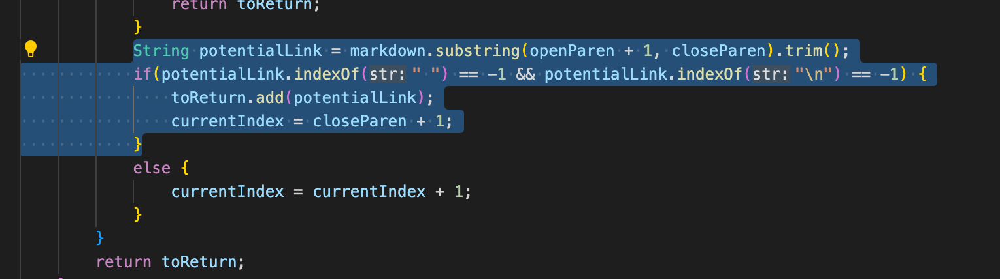
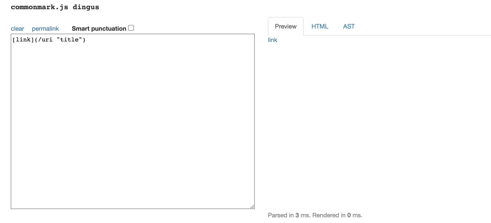
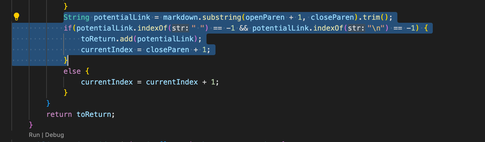

### Lab Report 5 ###

------------------------------
In this lab report, there will be two tests chosen 
from the 652 tests. These two tests, when ran, resulted in different answers between my implementation and the provided implementation.

 The four goals of each test is 1) Describe which implementation is correct, 2) Indicate both actual outputs and also what the expected output is, 3) show what it should produce using CommonMark.js, 4) For the implementation that’s not correct, the bug will be described in 2-3 sentences and the code that should be fixed will be shown (screenshot of code highlighting where the change needs to be made)

---------------------------

I found the different test results by using vimdiff on the results of running a bash for loop. 

I ran `bash script.sh > results.txt` to create a .txt file. By running `script.sh` in my repository, I have now two .txt files, one I generated and another from the provided implementation. To compare the results line by line, I used vimdiff to find any differences. 

----------------

### Test 1 ###

The Link to the test-file
[Link](https://github.com/nidhidhamnani/markdown-parser/blob/main/test-files/201.md?plain=1)

Using commonmark.js, the expected output is shown below in the image. 

This indicates there are no links produced and the output should be an empty bracket `[]`. Thus, `[]` is the expected output. 

With vimdiff, we can see the actual outputs. 
It's shown that my implementation (on the left) outputted a `[]` compared to the provided implementation(on the right) as it outputted `[baz]`. This means my implementation was the correct implementation as it outputted the empty bracket, which is the expected output. 

The image below shows the bug in markdownparse that should be fixed in order to prevent the incorrect output of `[baz]`. In vimdiff, it's shown that baz is outputted, which means that baz is being recognized as a link. The reason for this bug, is that the method doesn't check for `<>`. Withot checking for the `<` or `>`, baz is getting recognized as a link even though it clearly isn't. Thus, to fix it, the method needs to check for `<>`. 

-------------------

### Test 2 ###

The Link to the test-file
[Link](https://github.com/nidhidhamnani/markdown-parser/blob/main/test-files/481.md?plain=1)

Using commonmark.js, the expected output is shown below in the image. 

This means the expected output should be a link of `[uri "title"]` as the syntax of `[link]` clearly indicates the output will be a link. 

With vimdiff, we can see the actual outputs. 
It's shown that my implementation (on the left) outputted a `[uri "title"]` compared to the provided implementation(on the right) as it outputted `[]`. This means my implementation was the correct implementation as it outputted the `[uri "title"]`, which is the expected output. 

The image below shows the bug in markdownparse that should be fixed in order to prevent the incorrect output, the empty bracket. In vimdiff, it's shown that `[]` is outputted, which means that `/uri "title` is not being recognized as a link. The reason for this bug, is that there is a space in between `url "title` as the method only recognizes links with no space. The method doesn't take into account the space and is thus, disregarding the valid link. Thus, to fix it, the method needs to recognize that links with space in between is still a valid link. 

