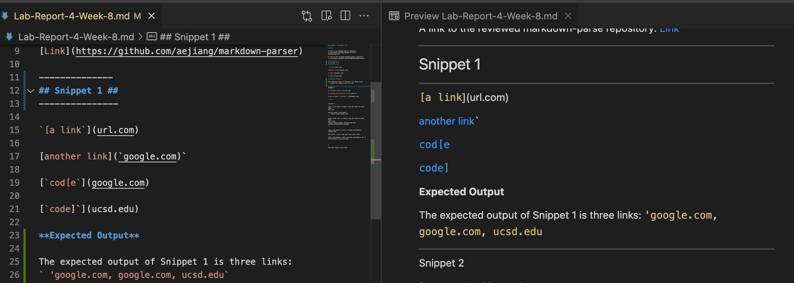

### Lab Report 5 ###

------------------------------
In this lab report, there will be two tests ran within MarkdownParse. The three goals of each tests is 1) Describe which implementation is correct, or neither if both give the wrong output, 2) Indicate both actual outputs and also what the expected output is, and 3) Decide on what it should produce by using VSCode 

