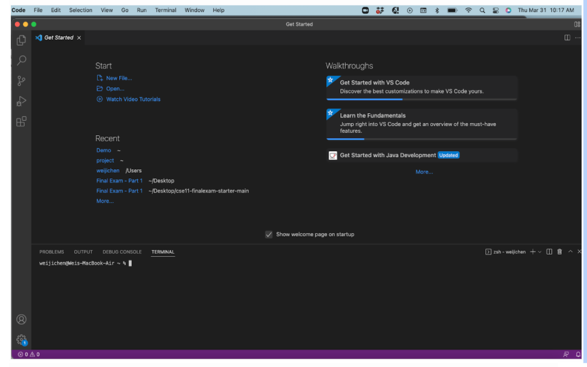
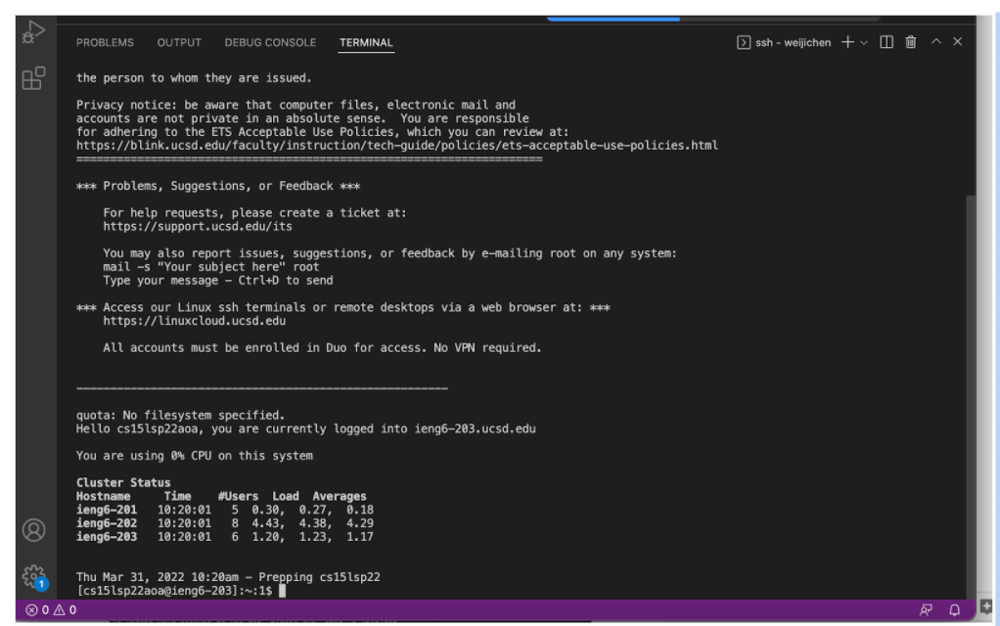
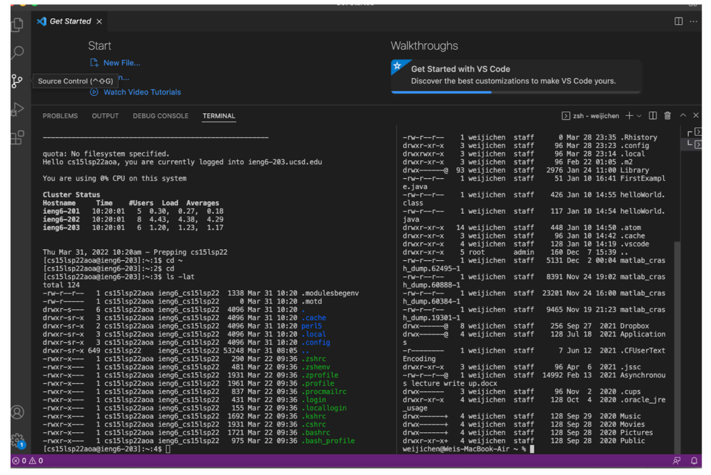
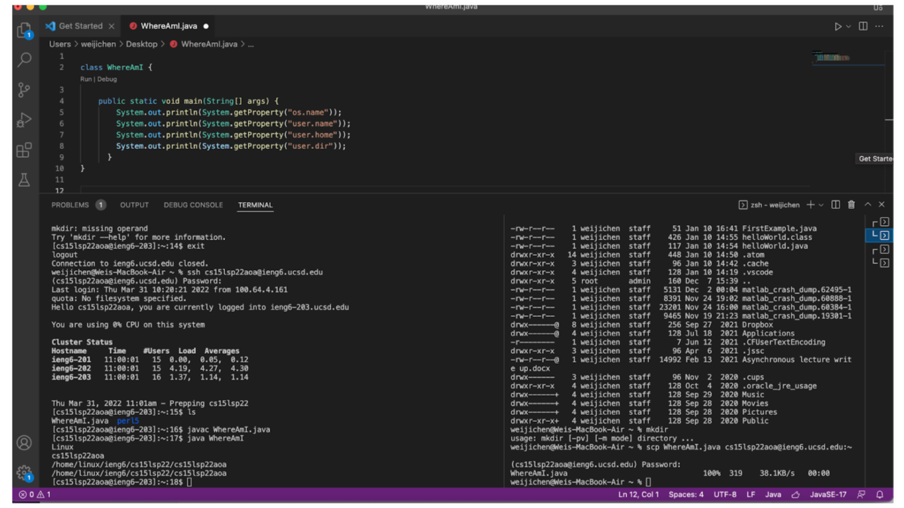
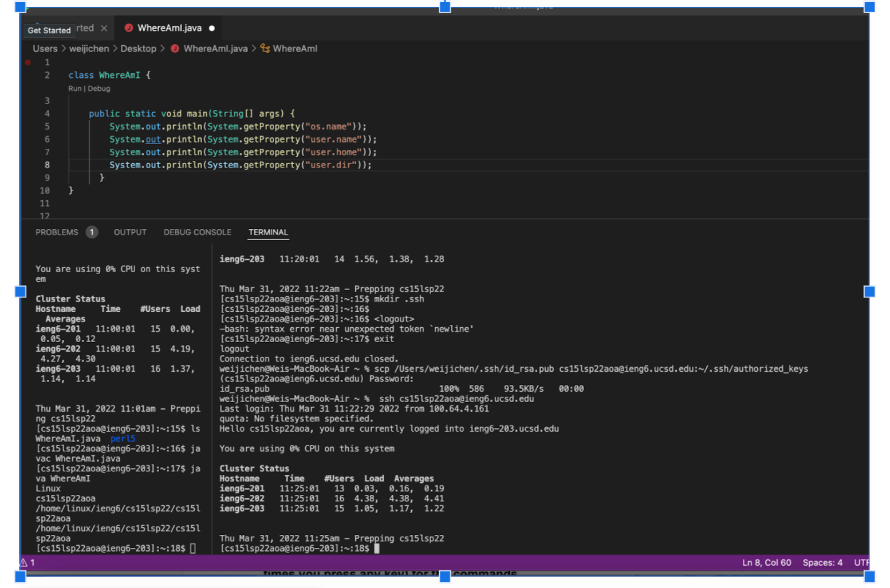
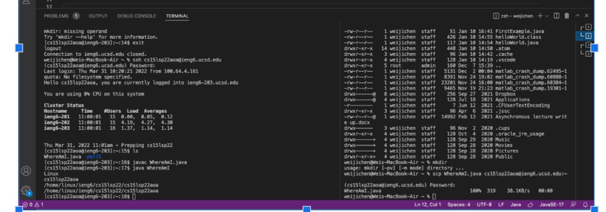

## **Accessing ieng6 Account Tutorial** 

--- 

Welcome! 

In this tutorial, I will teach you how to access an ieng6 account remotely. This can be applied to any ieng6 account, although we will be doing this in the context of CSE 15L. There will be detailed step by step instruction along with pictures to provide a visual guide so it's easier to follow along. This tutorial will be organized in six primary steps: 

1. VScode 
2. Connecting 
3. Commands 
4. SCP 
5. SSH Key 
6. Optimization

Let's begin! 

--- 
### **Installing VSCode** 

The first step to complete is to install a source code editor. We will be using VSCode. If you already have it, then you can skip this step. Otherwise, please go to the following website and downlowd the VSCode that matches your operating system. It's compatible with MacOs, Windows, and Linux so everyone should be able to download it without any problem. 

>https://code.visualstudio.com/download

Once downloaded, open VSCode. It should look something similar to this. Congrats with finishing the first step. 

*First time users of VSCode will open to a more blank screen. In the picture, my VSCode has the terminal open (the black bottom half of the picture) in addition to the depicted files I've recently open.*

--- 

### **Remotely Connecting** ###
---

Now, with VSCode installed, we can begin the second step, which is remotely connecting to another computer and accessing your ieng6 account. 

Note: If you are a Windows user, you must install OpenSSH. Follow the link below: 

>https://docs.microsoft.com/en-us/windows-server/administration/openssh/openssh_install_firstuse

For MacOs, Linux, and Windows (after installing OpenSSH), open the terminal in VSCode. To do so, look at the menu bar (the thin bar on the very top of a computer's screen, usually containing the word, 'File Edit...'), where you should see an option for *Terminal*. Click on *Terminal* and then select the *New Terminal*. Afterwards, type in the follow command. 

>ssh cs15lsp22***@ieng6.ucsd.edu

Replace the *** with the letters specific to your own account. If you don't know your account for CSE 15L, you can look it up on the following website: 

>https://sdacs.ucsd.edu/~icc/index.php

If additional messages appear asking if you want to confirm your attempt to connect, say yes. Otherwise, it would prompt you for a password. When you type, nothing will appear. That is normal since it's part of an encryption designed to keep your password safe. Finish typing your password and press enter/return. 

If you are successful, blocks of text will appear, as shown in the picture. 

Disregard most of the text, but you should make sure you see the following line appear in your terminal: 

>Hello cs15lsp22***, you are currently logged into ieng6-203.ucsd.edu 

Congrats! You've officially accessed your ieng6 account 

If you want to log out, simply type *exit* and enter. 

--- 

### **Commands** ### 
---
Now that you know how to access your ieng6 account remotely from your personal laptop or computer, it's good to learn what the different commands do. Understanding the command line is a great tool to have, so let's try some of the following commands. 

1. pwd
1. mkdir
1. mv
1. cd
2. ls -l
3. ls -a
4. ls -t 
5. ls 

Note: these are some of the more popular commands used. Feel free to test them out and google if you don't know what they do. 

In this image below, I've ran **Is -lat** into my personal computer and the remote computer I've accessed. You can also do this as long as you create two terminals (you can add additional terminals by clicking on the `+` button you should see on the right corner of your terminal). 

--- 

### **SCP Command** ###
---

SCP stands for secure copy and it's a command that allows you to copy files between two different computers, and you've guessed it, securely. As you may already know, in our case, you will be using it to copy files from your personal computer to the remote computer. 

To try this, first make sure you've exit out of your ieng6 account. If you haven't done so already, just press *exit* and enter. Next, either choose an existing file or create a new file on your commputer that you want to copy over to the remote computer. In the terminal, run the following command, replacing *filename* with the name of your file and *** with the letters specific to your account: 

> scp filename.java cs15lsp22***@ieng6.ucsd.edu:~/

If it prompts for a password, enter in your password again. Once done, let's check if scp worked! Log into your ieng6 account with the ssh command. 

>ssh cs15lsp22***@ieng6.ucsd.edu

Type the *ls* command into your terminal and if it worked, scp should have successfully copied over your file from your personal computer and into the remote computer. If you didn't already know, the *ls* command lists all of your files in your directory. Therefore, if scp worked, you should see your file now with *ls*. With it now successfully copied into the remote computer, you can run this file remotely using *javac* and *java*. 

The image below shows scp and ssh successfully implemented. The file I used was WhereAmI.java.

---

### **SSH Key** ###
----

Although ssh and scp are useful for accessing remote computer and to copy files between two different locations, they can be inefficient and time consuming, particularily if these commands need to be constantly re-run. There exists a significantly faster way to do this, ssh Keygen. 

ssh Keygen operates by creating two keys, one public and one private and with the creation of these keys, they are used in place of a password when the ssh command is run, which removes the need to enter a password everytime. 

To create the keys, the following command should be enter into terminal. 
>ssh-keygen

This will generate a block of text, with the last line asking you to enter a passphrase. Ignore this, don't enter passphrase, and press enter/return. It will ask you to enter a passphrase again, which you should now enter your password, before pressing enter/return. It will generate another block of text, with an randomart image at the bottom. Make sure to check these two key lines are present at the top of the texts. The *id_rsa* is the private key while *id_rsa.pub* is the public key.

>Your identification has been saved in /Users/
user-name>/.ssh/id_rsa.

>Your public key has been saved in /Users/user-name>/.ssh/id_rsa.pub.

To complete the process, type in the ssh command in the terminal and enter in your password. Then type in the following command before logging out. 
> mkdir.ssh 

This copies the public key to your .ssh directory and now, you can be use ssh to log in and scp to copy information from your personal computer to the remote computer without a password. 

The image below shows me successfully using scp using keygen 

---

### **Optimizing Remote Running** ###
---

Although using keygen already increases the speed of running command ssh and scp significantly, there are a few minor ways to increase the overall speed even more. The overall process is still as follows: 
Change and save file, scp file to server, run java and javac. 

However, time can be saved with commands. In the case of multiple files are being scp from personal computer to remote server, semicolons can be added inbetween the different filenames. Furthermore, when ssh is used to access remote servers, it can be combined with *ls* in a single line. Using the up arrow so you don't have to retype any lines is another method. The following picture is me rerunning the scp process with these methods in mind and I was able to shorten my time. You try it! 

Try to use these tricks and even develop your own method to increase remote running. Although it may not seem necessary now, it's a good skill to have to increase efficiency when you have to do this process over and over again. 

Good luck in CSE 15L. I hope this was a useful guide! 

---

[Lab Report 1](lab-report-1-week-2.html)

[Lab Report 1](https://Wei-Ji-Chen.github.io/cse15l-lab-reports/lab-report-1-week-2.html) 

